## Bloque 1: Conceptos básicos (teoría)

Define qué es un proceso y en qué se diferencia de un programa.

- Pues que un programa es el código en si, un proceso es el programa siendo ejecutado.

Explica qué es el kernel y su papel en la gestión de procesos.

- El kernel es la parte del software del ordenador que se ocupa de ejecutar los procesos y asignarles los recursos.

¿Qué son PID y PPID? Explica con un ejemplo.

- El PID y el PPID es el número identificador para un proceso. Por ejemplo 68439 xeyes

Describe qué es un cambio de contexto y por qué es costoso.

- El cambio de contexto es guardar y cargar el estado de procesos, cambiando entre ellos, y es costoso porque utiliza recursos de CPU y memoria.

Explica qué es un PCB (Process Control Block) y qué información almacena.

- Es una estructura que almacena la información de un proceso.

Diferencia entre proceso padre y proceso hijo.

- La diferencia entre un proceso padre y un proceso hijo es que el proceso hijo depende del proceso padre, es decir que no puede existir sin él, se puede cerrar el proceso hijo y el proceso padre puede seguir existiendo, pero si cierras el padre, el hijo se cierra.

Explica qué ocurre cuando un proceso queda huérfano en Linux.

- Cuando esto ocurre el proceso 1 llamado init lo adopta y se encarga de que haga su función correctamente.

¿Qué es un proceso zombie? Da un ejemplo de cómo puede ocurrir.

- Es un proceso el cual intentamos cerrar, pero por algun casual sigue encendido, por lo tanto no sabe que está muerto y ocupa recursos.

Diferencia entre concurrencia y paralelismo.

- Que en concurrencia los procesos se ejecutan al mismo tiempo en el mismo sitio, y en el paralelismo es al mismo tiempo pero en diferente sitio.

Explica qué es un hilo (thread) y en qué se diferencia de un proceso.

- Un hilo es parte de un proceso, un proceso puede tener varios hilos trabajando dentro de él, los procesos en cambio son más independientes.

## Bloque 2: Práctica con comandos en Linux

Usa echo $$ para mostrar el PID del proceso actual.

Usa echo $PPID para mostrar el PID del proceso padre.

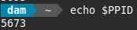

Ejecuta pidof systemd y explica el resultado.

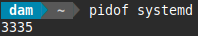

Abre un programa gráfico (ejemplo: gedit) y usa pidof para obtener sus PID.

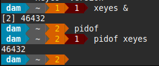

Ejecuta ps -e y explica qué significan sus columnas.

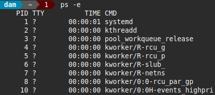

Ejecuta ps -f y observa la relación entre procesos padre e hijo.

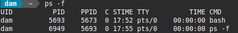

Usa ps -axf o pstree para mostrar el árbol de procesos y dibújalo.

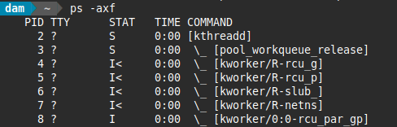

Ejecuta top o htop y localiza el proceso con mayor uso de CPU.

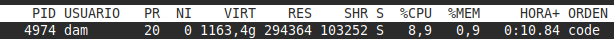

Ejecuta sleep 100 en segundo plano y busca su PID con ps.

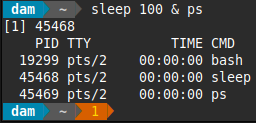

Finaliza un proceso con kill y comprueba con ps que ya no está.

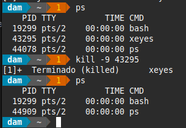

## Bloque 3: Procesos y jerarquía

Identifica el PID del proceso init/systemd y explica su función.

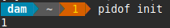

Explica qué ocurre con el PPID de un proceso hijo si su padre termina antes.

-

Ejecuta un programa que genere varios procesos hijos y observa sus PIDs con ps.

-

Haz que un proceso quede en estado suspendido con Ctrl+Z y réanúdalo con fg.

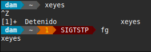

Lanza un proceso en segundo plano con & y obsérvalo con jobs.

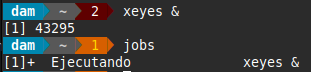

Explica la diferencia entre los estados de un proceso: Running, Sleeping, Zombie, Stopped.

- 

Usa ps -eo pid,ppid,stat,cmd para mostrar los estados de varios procesos.

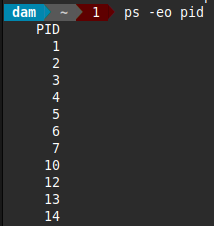

Ejecuta watch -n 1 ps -e y observa cómo cambian los procesos en tiempo real.

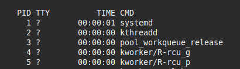

Explica la diferencia entre ejecutar un proceso con & y con nohup.

-

Usa ulimit -a para ver los límites de recursos de procesos en tu sistema.

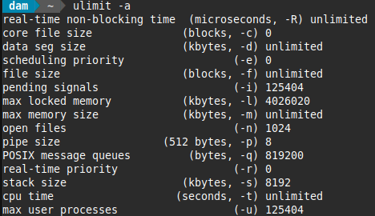

